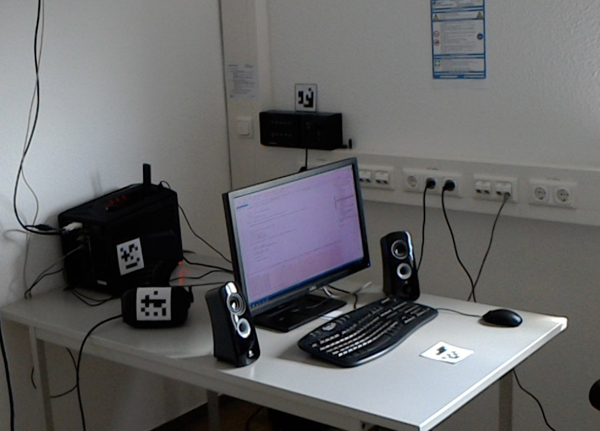
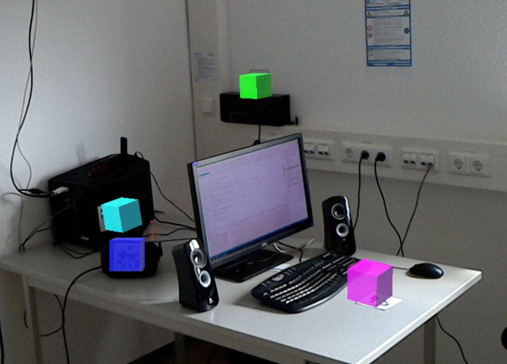

# MARKit_Unity

**M**arker **A**utomated **R**ecognition **Kit** is a project which uses visual marker (like QR codes)  for automated enrichment of a real environment with the MS Hololens.
Marker are used as interface between real and digital world.

See the [multiplayer branch](https://github.com/FlorianJa/MARKit_Unity/tree/multiplayer_master) for an example of how to share holograme between multiple hololenses.  

 
